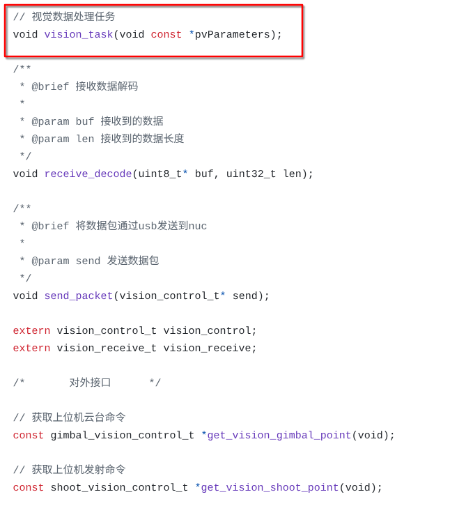
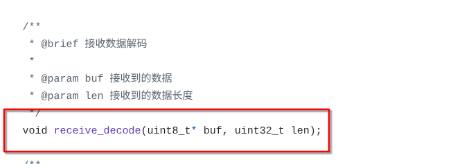
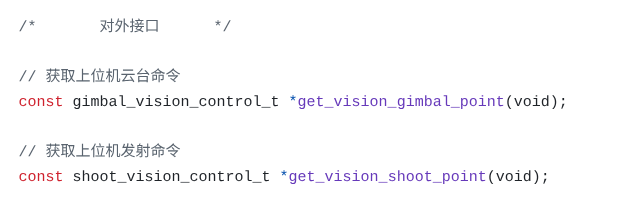

# 机器人辅助瞄准控制系统

## 一、简介

山东理工大学齐奇战队2025赛季机器人辅助瞄准系统开源，本系统在华南师范大学陈君前辈的rm_vision的基础上进一步开发，在参考新版的rm_vision的基础上，增加了灯条轮廓拟合方法，提升了PNP算法的稳定性，具体视觉部分代码请参考[视觉识别以及观测器部分](https://github.com/yuanluochen/qiqi_rm_vision);参考上海交通大学的开源和新版rm_vision中的电控代码参考，编写了rm_vision中缺少的电控解算部分，电控解算部分代码请参考 [电控解算部分vision_task](https://github.com/yuanluochen/vision_task)

## 二、代码部署流程

### 2.1 视觉代码部署

1. 在liunx系统下安装Docker

如果操作系统为Ubuntu系列操作系统或其衍生版本，请输入以下指令使用小鱼的安装脚本进行部署，安装完毕后重启计算机。

```bash
wget http://fishros.com/install -O fishros && sudo bash fishros
```
2. 构建Docker镜像

进入本工程目录，在该目录下输入以下指令，利用Dockerfile构建镜像

```bash
docker build --no-cache -t rm_vision .
```
3. 利用镜像生成容器

构建开发容器（这个是开机不自启，默认打开foxglove通信）

```bash
docker run -it --name rv_devel \
--privileged --network host \
-v /dev:/dev -v $HOME/.ros:/root/.ros -v ws:/ros_ws \
rm_vision:latest \
ros2 launch foxglove_bridge foxglove_bridge_launch.xml
```

构建运行容器（这个是开机自启，默认不打开foxglove通信）

```bash
docker run -it --name rv_runtime \
--privileged --network host --restart always \
-v /dev:/dev -v $HOME/.ros:/root/.ros -v ws:/ros_ws \
rm_vision:latest \
ros2 launch rm_vision_bringup vision_bringup.launch.py
```
4. 附加

容器工作空间卷删除指令（容器运行报错试试这个）

```bash
docker volume rm ws
```

### 2.2 电控代码部署

==前情提要：本实验室内电控整体工程中已完成添加该部分代码，可以不用自行添加到工程内部。以下内容为简要介绍如何添加该部分代码，由于各个队伍的电控工程结构差异较大，以下流程仅供参考。==

1. 下载电控部分代码，[点击进入电控代码部分链接](https://github.com/yuanluochen/vision_task)，或者输入以下指令克隆电控部分代码。
```bash
git clone https://github.com/yuanluochen/vision_task.git
```
2. 将上述代码添加到工程内部，同时注意电控部分工程要使用stm32，同时使能usb虚拟串口通信，使能具体流程请参考网络资料
3. 创建视觉任务线程，同时将下图所示线程函数添加进去
4. 将如下图所示的视觉解码函数添加到usb接收中断，此刻部署完毕
5. 在使用该部分代码时注意以下两个函数分别添加到云台任务和发射任务中，具体添加方法请参考，步兵电控的整体工程

## 三、工程资料参考

[《机器人辅助瞄准控制系统》](./docs/机器人辅助瞄准控制系统.pdf)——本论文为在下的本科生毕业论文，论文中第五章部分为在下电控代码部分的理论基础，其他部分为在下对rm_vision的视觉源码部分的理解。若读者对在下的电控解算部分感兴趣可阅读在下的论文。

## 四、辅助瞄准系统调参方法

代码调参部分可以参考我的学弟——齐浩龙编写的《QIQI视觉避坑手册》
